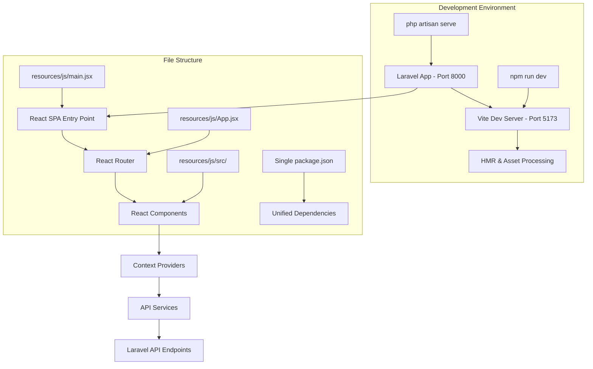

# Design Document

## Overview

This design addresses the critical React-Vite integration issues in the Laravel application. The primary problem is the "@vitejs/plugin-react can't detect preamble" error, which stems from configuration conflicts between multiple package.json files, incorrect Vite setup, and improper file structure organization. The solution involves consolidating configurations, fixing the Vite React plugin setup, and establishing a proper development workflow.

## Architecture

### Current Problem Analysis

The application currently has several configuration issues:

1. **Duplicate Package Management**: Two separate `package.json` files exist (root and `resources/js/`), creating dependency conflicts
2. **Vite Configuration Mismatch**: The main `vite.config.js` and `resources/js/vite.config.js` have different configurations
3. **React Plugin Detection**: The Vite React plugin fails to detect JSX preamble due to incorrect file processing
4. **File Structure Inconsistency**: React components are scattered across different directory structures

### Target Architecture



## Components and Interfaces

### 1. Vite Configuration Consolidation

**Primary Vite Config** (`vite.config.js`):
- Consolidate React plugin configuration
- Set up proper alias resolution
- Configure development server settings
- Handle Laravel integration properly

**Key Configuration Elements**:
```javascript
{
  plugins: [
    laravel({
      input: ['resources/css/app.css', 'resources/js/main.jsx'],
      refresh: true,
    }),
    react({
      jsxImportSource: 'react',
      babel: {
        plugins: [
          ['@babel/plugin-transform-react-jsx', { runtime: 'automatic' }]
        ]
      }
    })
  ],
  resolve: {
    alias: {
      '@': '/resources/js/src',
    },
  },
  server: {
    host: 'localhost',
    port: 5173,
    hmr: { host: 'localhost' }
  }
}
```

### 2. Package Management Unification

**Single Package.json Strategy**:
- Remove duplicate `resources/js/package.json`
- Consolidate all React dependencies in root `package.json`
- Ensure version compatibility across all packages
- Set up proper script commands

**Dependency Resolution**:
- React 18.3.1 with consistent versions
- Vite 4.x with proper React plugin
- Babel configuration for JSX transformation
- Bootstrap and related UI dependencies

### 3. File Structure Reorganization

**Proposed Structure**:
```
resources/js/
├── main.jsx              # Entry point
├── App.jsx               # Main App component
├── App.css               # Global styles
└── src/
    ├── components/       # Reusable components
    ├── Pages/           # Page components
    ├── context/         # React contexts
    ├── services/        # API services
    ├── utils/           # Utility functions
    └── __tests__/       # Test files
```

### 4. Context Provider Fix

**LanguageContext Enhancement**:
- Fix JSX syntax issues causing preamble errors
- Ensure proper React import statements
- Optimize Bootstrap CSS loading mechanism
- Handle RTL/LTR switching efficiently

**Context Integration**:
- Proper export/import patterns
- Consistent provider nesting
- Error boundary implementation
- Performance optimization

## Data Models

### Configuration Models

**Vite Configuration Model**:
```typescript
interface ViteConfig {
  plugins: Plugin[];
  resolve: {
    alias: Record<string, string>;
  };
  server: {
    host: string;
    port: number;
    hmr: HMRConfig;
  };
  build: BuildOptions;
}
```

**Package Configuration Model**:
```typescript
interface PackageConfig {
  dependencies: Record<string, string>;
  devDependencies: Record<string, string>;
  scripts: Record<string, string>;
  type: 'module';
}
```

### React Application Models

**App State Model**:
```typescript
interface AppState {
  language: 'ar' | 'en';
  isAuthenticated: boolean;
  cart: CartItem[];
  products: Product[];
  loading: boolean;
  error: string | null;
}
```

## Error Handling

### Vite Plugin Error Resolution

**Preamble Detection Fix**:
1. Ensure proper JSX pragma configuration
2. Set up correct Babel transformation
3. Configure React plugin with explicit options
4. Handle file extension resolution

**Development Server Error Handling**:
1. Proper CORS configuration for API calls
2. HMR error recovery mechanisms
3. Asset loading fallback strategies
4. Clear error messaging for developers

### Runtime Error Management

**React Error Boundaries**:
- Component-level error catching
- Graceful fallback UI rendering
- Error reporting and logging
- Development vs production error display

**API Communication Errors**:
- Network failure handling
- Authentication error management
- Data validation error display
- Retry mechanisms for failed requests

## Testing Strategy

### Unit Testing Configuration

**Jest Setup Enhancement**:
- Fix Babel configuration for JSX processing
- Proper module resolution for React components
- Mock configuration for external dependencies
- Coverage reporting setup

**Component Testing**:
- React Testing Library integration
- Context provider testing
- API service mocking
- User interaction testing

### Integration Testing

**Laravel-React Integration**:
- API endpoint testing with React components
- Authentication flow testing
- Cart functionality testing
- Route navigation testing

**Build Process Testing**:
- Development build verification
- Production build validation
- Asset optimization testing
- Performance benchmarking

## Implementation Phases

### Phase 1: Configuration Cleanup
1. Remove duplicate package.json files
2. Consolidate Vite configuration
3. Fix React plugin setup
4. Update import statements

### Phase 2: File Structure Optimization
1. Reorganize React components
2. Fix context provider exports
3. Update component imports
4. Standardize file naming

### Phase 3: Development Environment Setup
1. Configure Laravel-Vite integration
2. Set up proper development servers
3. Enable HMR functionality
4. Test API communication

### Phase 4: Error Resolution and Testing
1. Fix preamble detection errors
2. Implement error boundaries
3. Set up comprehensive testing
4. Validate production build

## Performance Considerations

### Bundle Optimization
- Code splitting for lazy-loaded components
- Vendor chunk separation
- Asset optimization and compression
- Tree shaking for unused code

### Development Performance
- Fast refresh for React components
- Efficient asset processing
- Optimized dependency resolution
- Minimal rebuild times

### Runtime Performance
- Context provider optimization
- Memoization for expensive operations
- Efficient re-rendering strategies
- API call optimization

## Security Considerations

### CSRF Protection
- Proper token handling in API calls
- Sanctum authentication integration
- Secure cookie configuration
- XSS prevention measures

### Asset Security
- Content Security Policy configuration
- Secure asset serving
- Environment variable protection
- Build artifact security