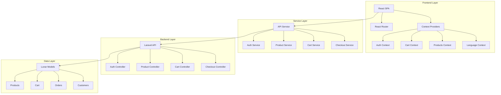
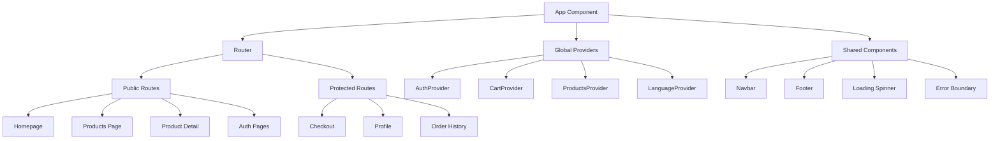
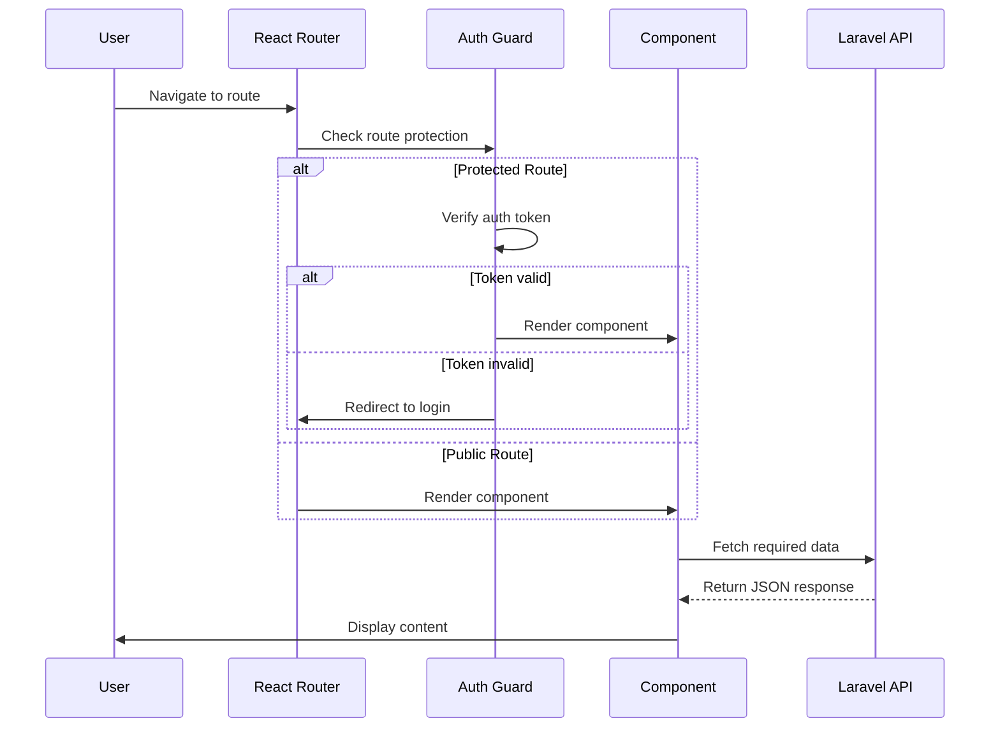
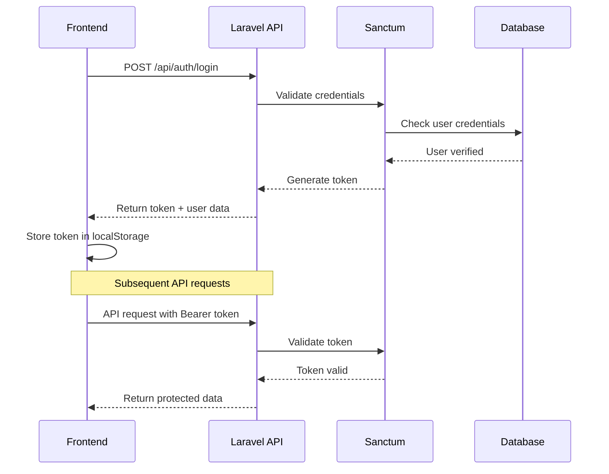
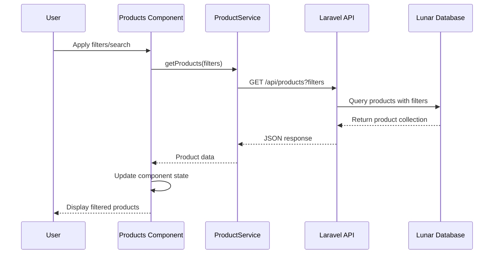
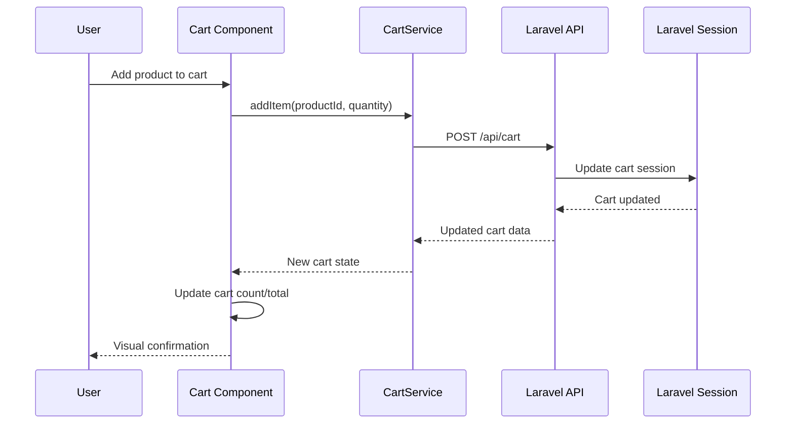
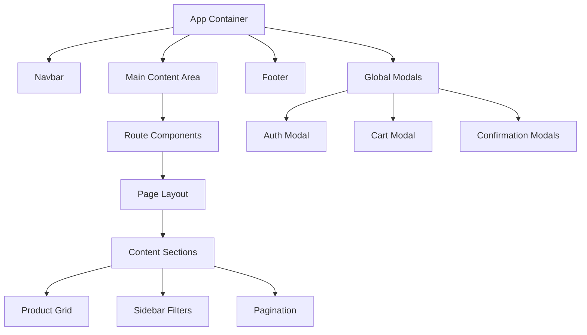

# React SPA Integration with Laravel API Backend

## Overview

This design outlines the transformation of a Laravel Livewire-based e-commerce application into a React Single Page Application (SPA) that consumes Laravel APIs. The system will maintain the existing Lunar e-commerce functionality while providing a modern, responsive frontend experience with improved performance and user interaction.

### Current Architecture
- **Frontend**: Laravel Livewire components with Blade templates
- **Backend**: Laravel with Lunar e-commerce package
- **Authentication**: Laravel Sanctum (already configured)
- **State Management**: Server-side state via Livewire

### Target Architecture
- **Frontend**: React SPA with client-side routing
- **Backend**: Laravel API-only backend serving JSON responses
- **Authentication**: Laravel Sanctum token-based authentication
- **State Management**: React Context API with persistent storage

## Technology Stack & Dependencies

### Frontend Stack
- **React 18+**: Modern React with hooks and concurrent features
- **React Router v6**: Client-side routing and navigation
- **React Context API**: Global state management for auth, cart, and products
- **Axios**: HTTP client with interceptors for API communication
- **Bootstrap 5**: UI framework with RTL/LTR support
- **Vite**: Build tool and development server

### Backend Stack  
- **Laravel 10+**: API backend framework
- **Laravel Sanctum**: Token-based authentication
- **Lunar Package**: E-commerce functionality and models
- **Laravel CORS**: Cross-origin resource sharing configuration

### Development Tools
- **Vite**: Frontend build system and hot reload
- **Laravel Vite Plugin**: Integration between Laravel and Vite
- **Jest + React Testing Library**: Frontend testing framework

## Architecture Design

### Application Structure

### Component Architecture

### State Management Architecture

| Context | Purpose | Persistent Storage | Scope |
|---------|---------|-------------------|-------|
| **AuthContext** | User authentication state, login/logout actions | localStorage (auth_token, user) | Global |
| **CartContext** | Shopping cart items, quantities, totals | sessionStorage (guest), API (authenticated) | Global |
| **ProductsContext** | Product listings, filters, search results | URL parameters, sessionStorage (filters) | Products pages |
| **LanguageContext** | UI language, RTL/LTR direction | localStorage (language preference) | Global |

## Routing & Navigation

### Route Structure

| Route Pattern | Component | Access Level | API Endpoints |
|---------------|-----------|--------------|---------------|
| `/` | Homepage | Public | `/api/products` (featured) |
| `/products` | ProductsPage | Public | `/api/products` |
| `/products/:slug` | ProductDetail | Public | `/api/products/{slug}` |
| `/collections/:slug` | CollectionPage | Public | `/api/collections/{slug}` |
| `/search` | SearchPage | Public | `/api/products/search` |
| `/cart` | CartPage | Public | `/api/cart` |
| `/checkout` | CheckoutPage | Protected | `/api/checkout/*` |
| `/profile` | ProfilePage | Protected | `/api/auth/user` |
| `/orders` | OrdersPage | Protected | `/api/orders` |

### Navigation Flow

## API Integration Layer

### Authentication Flow

### API Service Configuration

The API service layer provides a centralized HTTP client with the following features:

- **Base Configuration**: Axios instance with default headers and CSRF protection
- **Token Management**: Automatic Bearer token attachment from localStorage
- **Error Handling**: Global error interceptors for 401/422 responses
- **Request Interceptors**: CSRF token and authentication headers
- **Response Interceptors**: Token refresh and validation error handling

### Service Layer Architecture

| Service | Responsibilities | Key Methods |
|---------|------------------|-------------|
| **AuthService** | Login, logout, registration, user profile | `login()`, `logout()`, `register()`, `getUser()` |
| **ProductService** | Product listings, search, filtering | `getProducts()`, `searchProducts()`, `getProduct()` |
| **CartService** | Cart management, line items | `getCart()`, `addItem()`, `updateItem()`, `removeItem()` |
| **CheckoutService** | Checkout process, payment | `getCheckout()`, `setAddress()`, `processPayment()` |

## Data Flow Between Layers

### Product Browsing Flow

### Cart Management Flow

## Authentication & Security

### Authentication Strategy

The system implements token-based authentication using Laravel Sanctum:

1. **Guest State**: Users can browse products and manage cart without authentication
2. **Login Process**: Username/password exchanged for Bearer token
3. **Token Storage**: Secure storage in localStorage with automatic cleanup
4. **Protected Routes**: Checkout and profile features require authentication
5. **Token Refresh**: Automatic token validation and logout on expiry

### Security Measures

| Security Layer | Implementation | Purpose |
|----------------|----------------|---------|
| **CSRF Protection** | Laravel CSRF tokens in API headers | Prevent cross-site request forgery |
| **CORS Configuration** | Configured for React development server | Control cross-origin requests |
| **Token Validation** | Sanctum middleware on protected routes | Ensure authenticated access |
| **Input Validation** | Laravel form requests and validation rules | Sanitize and validate user input |
| **Rate Limiting** | Laravel throttling on auth endpoints | Prevent brute force attacks |

## Styling Strategy

### Bootstrap 5 Integration

- **Responsive Grid**: Mobile-first responsive layout system
- **Component Library**: Pre-built UI components (buttons, forms, modals)
- **RTL/LTR Support**: Automatic text direction switching for Arabic/English
- **Theme Customization**: Custom CSS variables for brand colors and spacing
- **Icon Integration**: Bootstrap Icons for consistent iconography

### Layout Structure

## Testing Strategy

### Frontend Testing Approach

| Test Type | Framework | Scope | Coverage |
|-----------|-----------|-------|----------|
| **Unit Tests** | Jest + React Testing Library | Individual components and utilities | Component logic, state management |
| **Integration Tests** | Jest + MSW (Mock Service Worker) | API service interactions | Service layer functionality |
| **Component Tests** | React Testing Library | User interactions and UI behavior | User workflows and form validation |
| **E2E Tests** | Cypress (future enhancement) | Complete user journeys | Critical business flows |

### Backend API Testing

The existing Laravel test suite should be extended to cover API endpoints:

- **Feature Tests**: API endpoint responses and authentication
- **Unit Tests**: Controller logic and service classes
- **Database Tests**: Data persistence and relationships

## Migration Strategy

### Phase 1: Infrastructure Setup
1. Configure Vite build system for React development
2. Set up React Router and basic component structure
3. Implement API service layer with authentication
4. Create global state management contexts

### Phase 2: Core Functionality Migration
1. Migrate product browsing functionality
2. Implement cart management with session persistence
3. Set up authentication flow with login/logout
4. Create responsive layout with Bootstrap integration

### Phase 3: Advanced Features
1. Implement checkout process with payment integration
2. Add user profile and order history
3. Implement search and filtering capabilities
4. Add multilingual support with RTL/LTR switching

### Phase 4: Testing & Optimization
1. Comprehensive testing suite implementation
2. Performance optimization and code splitting
3. SEO improvements and meta tag management
4. Production deployment configuration

## Route Configuration Changes

### Laravel Routes Transformation

**Current Web Routes** (to be removed):
- All Livewire component routes will be replaced with API endpoints
- Web routes will only serve the React SPA entry point

**New API Routes** (already implemented):
- Authentication endpoints (`/api/auth/*`)
- Product endpoints (`/api/products/*`)  
- Cart endpoints (`/api/cart/*`)
- Checkout endpoints (`/api/checkout/*`)

**SPA Entry Point**:
- All web routes will serve the React application
- React Router handles client-side routing
- Laravel serves static React build files

### Build System Integration

The Vite configuration needs to be updated to:
1. Build React application for production
2. Generate manifest for Laravel asset helpers
3. Handle hot module replacement in development
4. Optimize bundle size with code splitting

This transformation will result in a modern, performant e-commerce platform that leverages the best of both Laravel's robust backend capabilities and React's dynamic frontend experience.