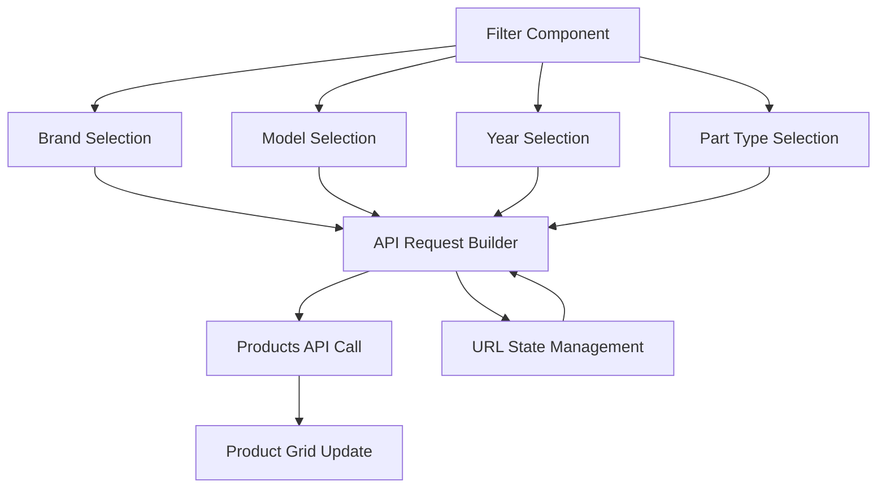
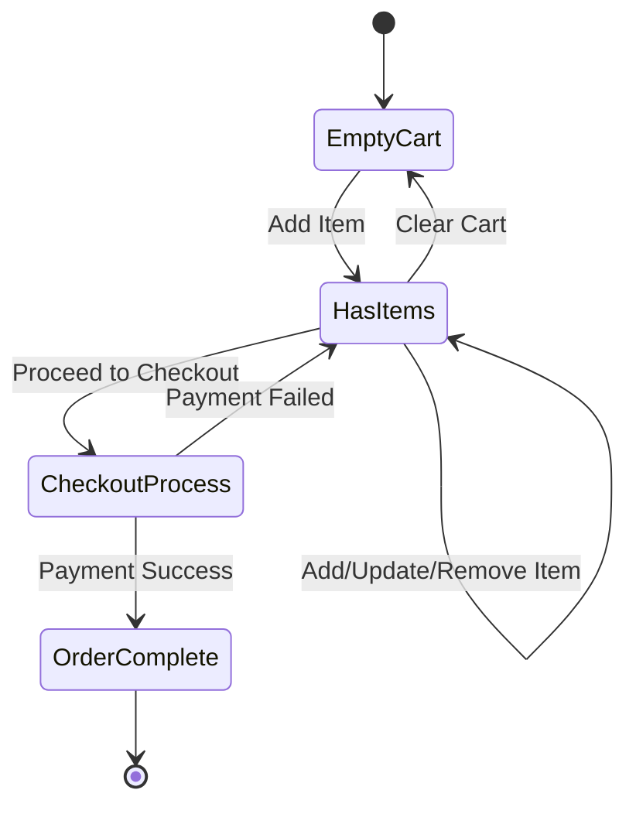
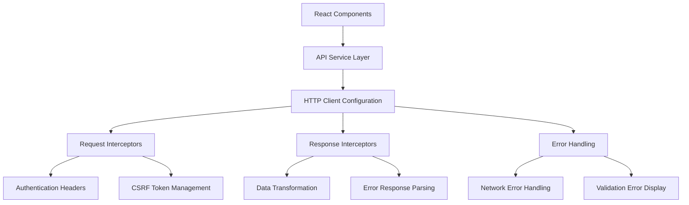
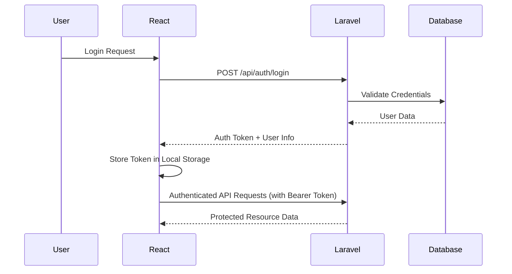
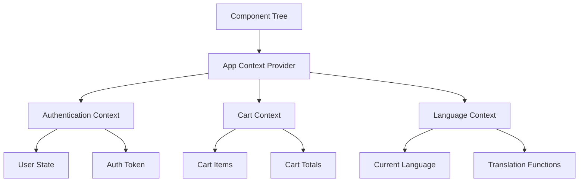
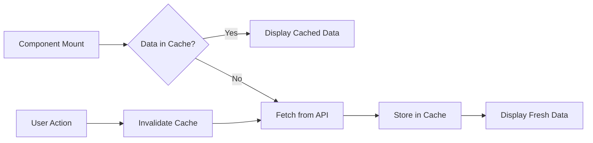

# React Shop Page Integration Design

## Overview

This design document outlines the architecture for integrating the existing React-based SpareParts components with the Laravel backend API. The system will transform the current static product display into a fully functional e-commerce interface that communicates with the Laravel Lunar e-commerce API endpoints.

The integration focuses on the SpareParts page which consists of three main components: Product Listing, Filtering Sidebar, and Request Form. The design ensures seamless data flow between the React frontend and Laravel backend while maintaining the existing RTL/LTR language support and responsive design.

## Technology Stack & Dependencies

### Frontend Stack
- **React 18.3.1**: Component-based UI framework
- **Bootstrap 5.3.5**: CSS framework for responsive design
- **Bootstrap Icons 1.11.3**: Icon library for UI elements
- **React Router DOM 7.9.1**: Client-side routing
- **Vite 6.3.1**: Build tool and development server

### Backend Integration
- **Laravel Framework**: PHP web application framework
- **Laravel Sanctum**: API authentication system
- **Lunar E-commerce Package**: E-commerce functionality
- **CORS Configuration**: Cross-origin resource sharing for API communication

### Communication Protocol
- **REST API**: HTTP-based API communication
- **JSON**: Data interchange format
- **CSRF Protection**: Cross-site request forgery protection via Sanctum
- **Session-based Cart**: Stateful cart management for guest users

## Component Architecture

### Product Display System

The product listing architecture transforms static product cards into dynamic, API-driven components that support real-time inventory updates and user interactions.

#### Product Grid Component Structure
```
Products Component
├── Product Fetching Logic
│   ├── API Service Integration
│   ├── Pagination Management
│   └── Loading State Handling
├── Product Card Rendering
│   ├── Dynamic Image Display
│   ├── Price Calculation
│   ├── Stock Availability
│   └── Brand Logo Integration
└── User Interaction Handlers
    ├── Add to Cart Functionality  
    ├── Wishlist Integration
    └── Product Preview Modal
```

#### Product Data Model
The component will handle product objects with the following structure:

| Field | Type | Description | Source |
|-------|------|-------------|--------|
| id | Integer | Unique product identifier | Laravel Product Model |
| name | String | Product title (multilingual) | Translated attribute |
| description | String | Product description | Translated attribute |
| slug | String | URL-friendly identifier | Product URL model |
| images | Array | Product image collection | Media attachments |
| variants | Array | Product variant options | Variant model with pricing |
| category | String | Product classification | Product taxonomy |
| brand | Object | Manufacturer information | Brand relationship |
| price | Object | Pricing information | Base price with currency |
| stock | Integer | Available inventory | Variant stock level |
| discount | Object | Discount information | Calculated from pricing rules |

### Filtering & Search System

The sidebar filtering system provides users with comprehensive product discovery capabilities through brand selection, model filtering, year specification, and part type categorization.

#### Filter State Management


#### Filter Parameter Mapping

| UI Filter | API Parameter | Value Format | Validation |
|-----------|---------------|--------------|------------|
| Car Brand | brand | String (slug) | Required selection from available brands |
| Car Model | model | String (slug) | Dependent on brand selection |
| Manufacturing Year | year | Integer (YYYY) | Range validation (2010-2025) |
| Part Type | part_type | Enum | original/commercial |
| Search Query | q | String | Minimum 2 characters |
| Price Range | price_min, price_max | Float | Positive numbers |

### Cart Management System

The cart system provides seamless integration with Laravel's stateful cart management, supporting both guest and authenticated user sessions through Sanctum authentication.

#### Cart Operations Architecture


#### Cart State Management

| Operation | Endpoint | Method | Request Format | Response Format |
|-----------|----------|--------|----------------|-----------------|
| Get Cart | /api/cart | GET | - | Cart object with lines |
| Add Item | /api/cart | POST | {variant_id, quantity} | Updated cart state |
| Update Item | /api/cart/{lineId} | PUT | {quantity} | Updated cart state |
| Remove Item | /api/cart/{lineId} | DELETE | - | Updated cart state |
| Clear Cart | /api/cart | DELETE | - | Empty cart confirmation |

## API Integration Layer

### HTTP Client Configuration

The API client will be configured to handle authentication, error responses, and request/response transformation consistently across all components.

#### API Service Architecture


#### Request/Response Transformation

| Data Type | Request Format | Response Format | Transformation Logic |
|-----------|---------------|-----------------|---------------------|
| Product Data | Filter parameters as query string | Paginated product collection | Map Laravel model to component props |
| Cart Operations | Variant ID and quantity | Cart state with totals | Transform pricing format for display |
| User Authentication | Credentials object | User data with token | Store token for subsequent requests |
| Address Data | Form field object | Formatted address object | Country/state normalization |

### Authentication Integration

User authentication will be managed through Laravel Sanctum, providing secure API access for both guest and registered users.

#### Authentication Flow


#### Authentication State Features

| Feature | Implementation | Storage Method | Security Consideration |
|---------|---------------|----------------|----------------------|
| Token Storage | Local Storage | Encrypted token string | Automatic expiration handling |
| Session Management | React Context | In-memory state | Clear on logout/refresh |
| Protected Routes | Route Guards | Authentication checks | Redirect to login when expired |
| API Request Headers | Axios Interceptors | Bearer token injection | Token validation on each request |

## State Management Strategy

### Component State Architecture

The application will use React's built-in state management with Context API for global state sharing, avoiding the complexity of external state management libraries.

#### Global State Structure


#### State Management Patterns

| State Type | Management Pattern | Update Triggers | Persistence Method |
|------------|-------------------|-----------------|-------------------|
| Product Filters | Local Component State | User filter interactions | URL parameters |
| Cart Contents | Global Context | Add/remove/update operations | Session storage |
| User Authentication | Global Context | Login/logout events | Local storage |
| Language Preference | Global Context | Language switch action | Local storage |
| Loading States | Local Component State | API request lifecycle | Memory only |

### Data Fetching Strategy

#### API Call Optimization


## Routing & Navigation

### URL Structure Design

The application will maintain SEO-friendly URLs that support both language variants and preserve filter states.

#### Route Configuration

| Route Pattern | Component | Parameters | Language Support |
|---------------|-----------|------------|------------------|
| /spare-parts | SpareParts | query, filters | /ar/spare-parts |
| /spare-parts/search | SpareParts | q, brand, model | /ar/spare-parts/search |
| /product/{slug} | ProductDetail | slug | /ar/product/{slug} |
| /cart | Cart | - | /ar/cart |
| /checkout | Checkout | step | /ar/checkout |

#### Filter State in URLs

Filter parameters will be preserved in URL query strings to enable bookmarking and sharing of filtered results.

```
Example URLs:
/spare-parts?brand=bmw&model=x5&year=2023&part_type=original
/spare-parts/search?q=brakes&brand=mercedes&page=2
```

## Testing Strategy

### Component Testing Approach

Each component will have comprehensive tests covering user interactions, API integration, and error scenarios.

#### Test Coverage Areas

| Component | Test Types | Coverage Focus |
|-----------|------------|----------------|
| Products Grid | Unit + Integration | API data rendering, pagination, loading states |
| Filter Sidebar | Unit | Filter state management, API parameter building |
| Product Card | Unit | Price formatting, stock display, action handlers |
| Cart Management | Integration | Add/remove operations, quantity updates |
| API Services | Unit | Request/response handling, error scenarios |
| Authentication | Integration | Login/logout flow, token management |

#### Testing Tools Configuration

| Tool | Purpose | Configuration |
|------|---------|---------------|
| React Testing Library | Component testing | Test user interactions |
| MSW (Mock Service Worker) | API mocking | Mock Laravel endpoints |
| Jest | Test runner | Coverage reporting |

### Integration Testing Strategy

End-to-end testing will verify the complete user journey from product discovery to purchase completion.

#### Critical User Flows

1. **Product Discovery Flow**
   - Load product grid → Apply filters → View filtered results → Reset filters

2. **Shopping Cart Flow**  
   - Add product to cart → Update quantities → Remove items → Clear cart

3. **Checkout Process Flow**
   - Review cart → Enter shipping info → Select payment method → Complete order

4. **Authentication Flow**
   - Register account → Login → Access protected features → Logout